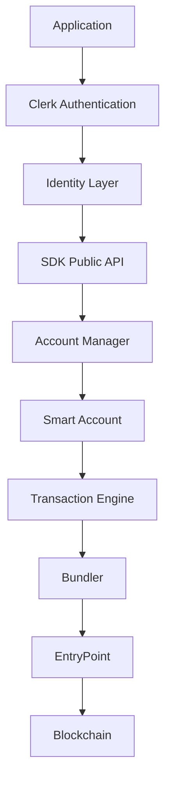
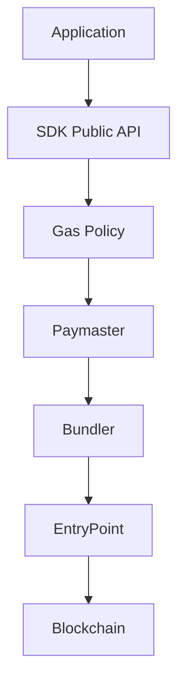
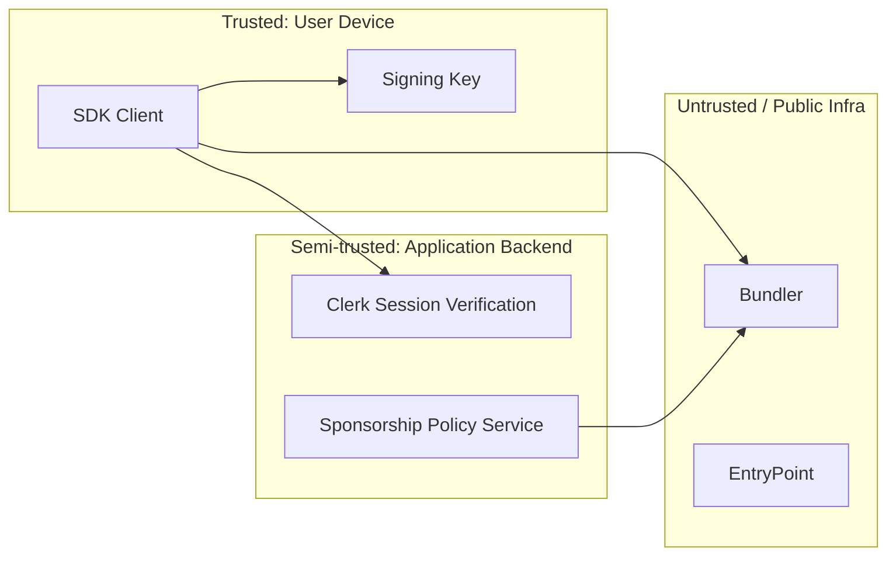

# Architecture

## Layering Principle

The system is split into a **Public Layer** (what developers touch)
and an **Internal Layer** (what the SDK manages and never exposes as
a required concept).

- Public Layer: `identity`, `account`, `transaction`, `message`,
  `sponsorship`, `receipt`.
- Internal Layer: Clerk adapter, Account Manager, Smart Account
  contract, Transaction Engine, Bundler client, Paymaster client,
  EntryPoint.

## Primary Flow

## Sponsorship Flow

## Component Responsibilities

| Component | Responsibility | Exposed to developer? |
|---|---|---|
| Identity Adapter (Clerk) | Resolve authenticated user → stable identity reference | No (consumed internally by `getAccount`) |
| Account Manager | Resolve/derive/deploy the smart account for an identity | Indirectly via `account` object |
| Smart Account (contract) | On-chain validation + execution | No |
| Account Factory (contract) | Deterministic (CREATE2) account deployment | No |
| Transaction Engine | Turn a transaction intent into a signed UserOperation and track it to confirmation | No (consumed via `sendTransaction`) |
| Bundler Client | Talk to bundler RPC (submit, estimate, poll receipt) | No |
| Gas Policy / Paymaster Client | Decide and execute gas sponsorship | Indirectly via `sponsorship` config |
| Signer / Key Management | Hold/derive the signing key, produce signatures | No |
| Error Translator | Convert low-level errors into SDK error types | Yes, as SDK error types |

## Trust Boundaries (see also SECURITY.md)

The backend authenticates the user and may authorize sponsorship; it
never holds an unrestricted signing key for the user's smart account
(see `docs/KEY_MANAGEMENT.md`).

## Architectural Invariants

1. Clerk identity and blockchain signing authority are always
   represented as separate objects, never conflated.
2. No public API requires a developer to construct, inspect, or
   reason about a `UserOperation`.
3. The smart account address is derivable before deployment
   (counterfactual), from identity + chain + implementation version.
4. All ERC-4337 error surfaces are translated to SDK error types
   before reaching the developer.
