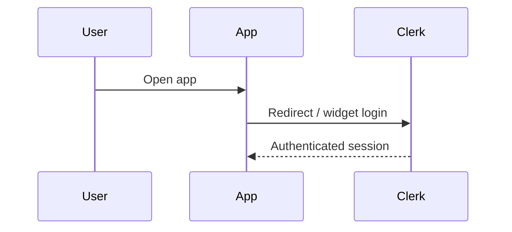
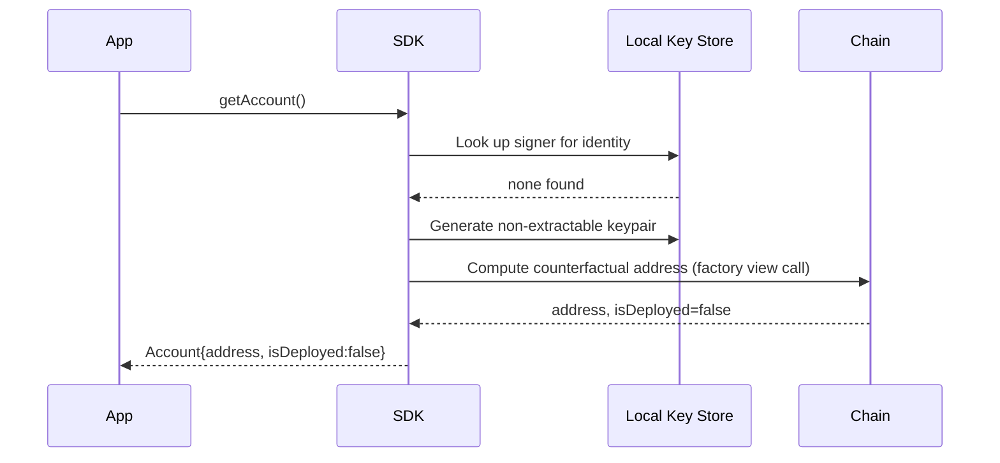
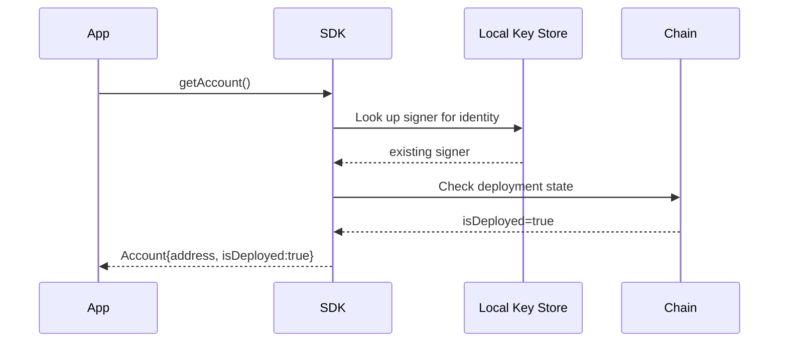
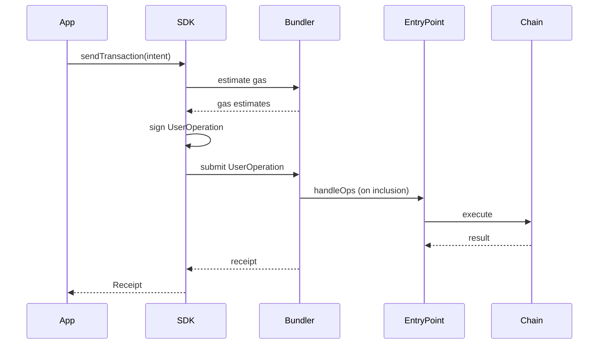
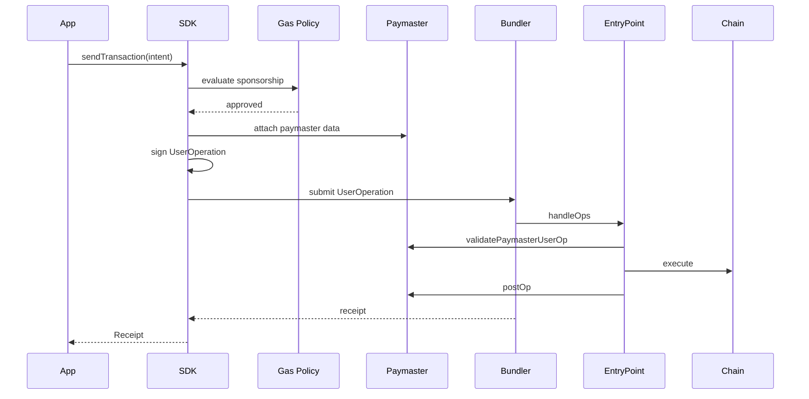
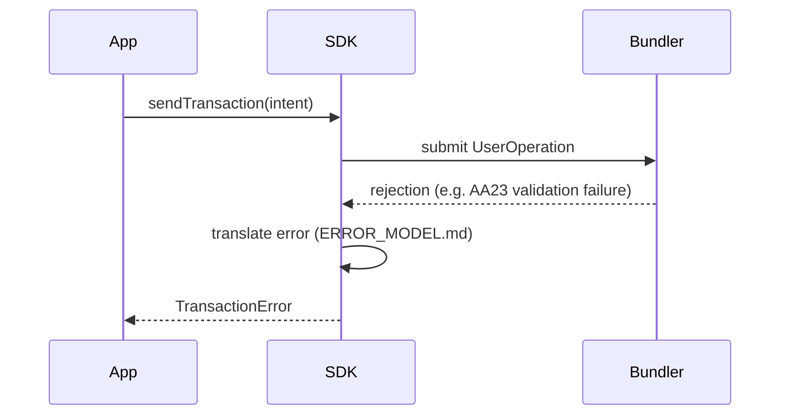
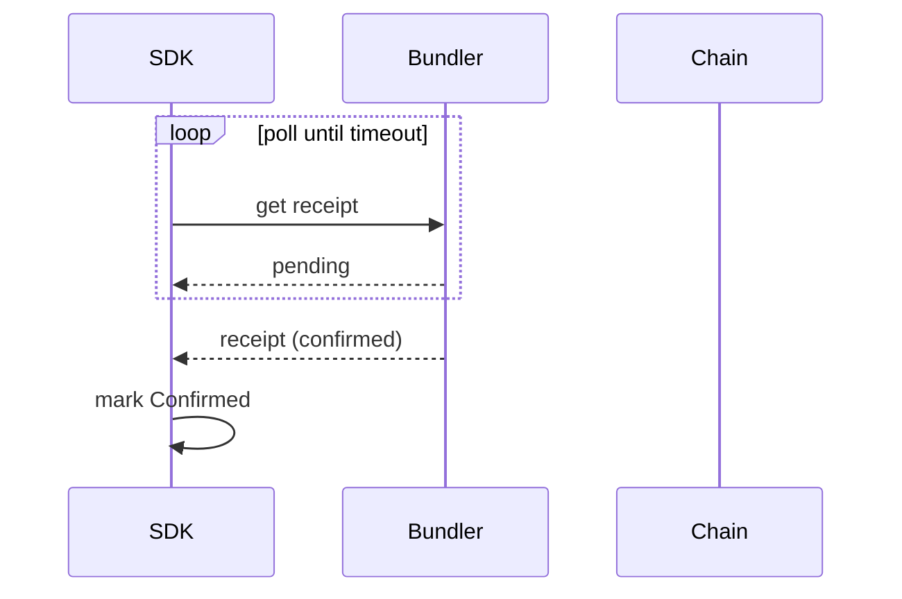

# Data Flow (Sequence Diagrams)

## Login

## Account Resolution — First-Time User

## Account Resolution — Returning User

## Transaction (Unsponsored)

## Sponsored Transaction

## Failed Transaction

## Transaction Confirmation

