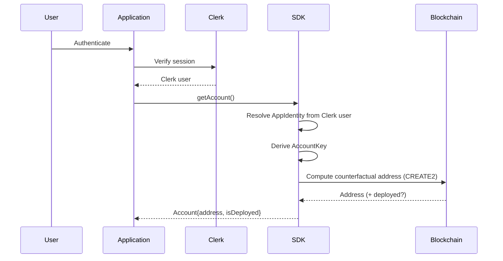

# Identity Architecture

## The Three Layers (must never be conflated)

```text
Authentication  →  "This session belongs to Clerk user X."
Authorization   →  "User X is entitled to control smart account Y."
Signing         →  "This specific action is cryptographically
                     approved by the key controlling smart account Y."
```

Clerk answers Authentication only. Authorization (identity → account
binding) and Signing (see `KEY_MANAGEMENT.md`) are the SDK's
responsibility and are implemented independently of Clerk.

## Identity → Account Model

An `AppIdentity` is the tuple:

```text
AppIdentity = {
  provider: "clerk",
  subjectId: <Clerk user id>,
  namespace: <application/tenant identifier>,
}
```

The smart account address is derived deterministically from:

```text
AccountKey = {
  identity: AppIdentity,
  chainId: <target chain>,
  accountImplementationVersion: <smart account impl version>,
  signerKeyId: <reference to the signing key/public key material>,
}
```

`AccountKey` is the CREATE2 salt input (see `ACCOUNT_FACTORY.md`); it
is never a raw database-assigned incrementing ID, and it must not
collapse to `subjectId` alone — chain and implementation version must
be included so that account addresses are stable across
implementation upgrades that intentionally choose *not* to reuse the
same address, and distinguishable per chain.

## Why Not `Clerk user ID → wallet address` Directly

A naive one-way mapping in a centralized table:

- cannot be recomputed/verified independently by the SDK or a third
  party,
- does not generalize to multi-chain,
- does not generalize to an implementation upgrade,
- creates a single point of failure (the mapping table) with no
  cryptographic backing.

Instead, the address must be **derivable**, not merely **looked up**.
The mapping table (if any) is a cache of a value that can always be
recomputed from `AccountKey`.

## Multi-Device Question (MVP position)

For the MVP, one identity maps to exactly one signing key and
therefore one account per chain (see `KEY_MANAGEMENT.md` for how that
key is held). Multi-device access to the *same* account is explicitly
out of scope for the MVP and is the first roadmap item (see
`ROADMAP.md`) — it requires the account's owner model to support
multiple authorized keys, which is a smart-account capability, not an
identity-layer capability.

## Sequence: Identity → Account Resolution


