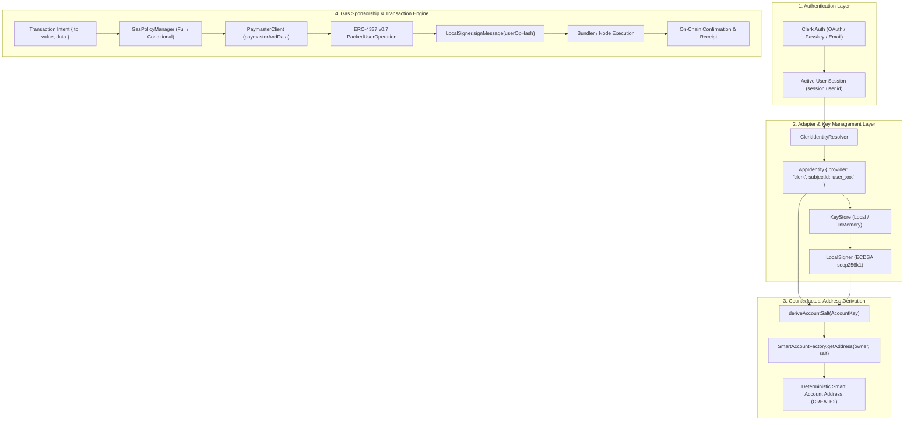

# Identity AA SDK: Complete End-to-End Workflow & Architecture Guide

This document explains the complete lifecycle of how the **Identity Account Abstraction (AA) SDK** works—from user authentication via Clerk to counterfactual deterministic smart account resolution, paymaster gas sponsorship, and on-chain transaction execution.

---

## 🏗️ 1. Architecture Overview



---

## 🔄 2. Step-by-Step Lifecycle

### Step 1: User Signs In with Clerk
When the user authenticates with Clerk (via Google, GitHub, Apple, Email OTP, or Passkeys):
1. Clerk issues a cryptographically authenticated session.
2. The user has a stable, immutable identifier: `session.user.id` (e.g. `user_2t1aBc...`).

### Step 2: Identity Resolution (`@identity-aa-sdk/clerk`)
The [`ClerkIdentityResolver`](file:///c:/Users/Akshad/Desktop/identity-aa-sdk/packages/clerk/src/index.ts) extracts the authenticated session and maps it into a standardized `AppIdentity`:
```ts
const resolver = new ClerkIdentityResolver(() => clerk.session);
const identity = await resolver.resolveIdentity();
// Result:
// {
//   provider: "clerk",
//   subjectId: "user_2t1aBc...",
//   metadata: { email: "user@example.com", name: "Alice" }
// }
```

### Step 3: Deterministic Signing Key Management
The SDK checks the [`KeyStore`](file:///c:/Users/Akshad/Desktop/identity-aa-sdk/packages/core/src/internal/signer/keystore.ts) for a non-extractable client-held private key bound to this identity and chain:
* Lookup key: `signer_clerk_user_2t1aBc..._31337`
* If not present, a new high-entropy secp256k1 key is generated locally on the device using Web Crypto and saved to the `KeyStore`.
* The private key **never leaves the user's client**.

### Step 4: Deterministic Counterfactual Address Derivation (CREATE2)
The smart contract wallet address is computed mathematically before deployment:
1. Build the immutable tuple `AccountKey`:
   $$\text{AccountKey} = (\text{provider}, \text{subjectId}, \text{chainId}, \text{implementationVersion}, \text{signerKeyId})$$
2. Derive deterministic 32-byte salt:
   $$\text{salt} = \text{keccak256}(\text{encodePacked}(\text{AccountKey}))$$
3. Compute the `CREATE2` address from the `SmartAccountFactory`:
   $$\text{AccountAddress} = \text{keccak256}(0xff \parallel \text{factoryAddress} \parallel \text{salt} \parallel \text{initCodeHash})[12..31]$$
4. **Immediate Availability**: The user now has their smart account address immediately without spending any gas or waiting for a deployment transaction.

### Step 5: Gas Policy & Paymaster Sponsorship
When the user sends a transaction:
1. The developer configures `sponsorship: { type: "full" }` (or conditional spend rules).
2. The [`GasPolicyManager`](file:///c:/Users/Akshad/Desktop/identity-aa-sdk/packages/core/src/internal/gasPolicy/gasPolicy.ts) evaluates the transaction against whitelist rules and spend limits.
3. Upon approval, [`PaymasterClient`](file:///c:/Users/Akshad/Desktop/identity-aa-sdk/packages/core/src/internal/paymaster/paymasterClient.ts) encodes the ERC-4337 v0.7 `paymasterAndData`:
   $$[\text{paymasterAddress (20B)}] \parallel [\text{verificationGasLimit (16B)}] \parallel [\text{postOpGasLimit (16B)}] \parallel [\text{paymasterData}]$$
4. The user pays **$0 in gas fees**.

### Step 6: UserOperation Assembly & Signing
The [`TransactionEngine`](file:///c:/Users/Akshad/Desktop/identity-aa-sdk/packages/core/src/internal/transactionEngine/engine.ts) packs the UserOp struct:
* **`sender`**: The derived smart account address.
* **`nonce`**: Queried from the EntryPoint.
* **`initCode`**: If undeployed, includes `[factoryAddress] + factory.createAccount(owner, salt)`.
* **`callData`**: Encoded `execute(to, value, data)`.
* **`accountGasLimits`**: Packed `verificationGasLimit` and `callGasLimit`.
* **`paymasterAndData`**: Packed Paymaster sponsorship payload.
* The local signer computes the ERC-4337 v0.7 hash:
  $$\text{userOpHash} = \text{keccak256}(\text{packUserOp}(userOp) \parallel \text{entryPointAddress} \parallel \text{chainId})$$
* The device signer signs `userOpHash` to produce `userOp.signature`.

### Step 7: Execution & 7-Stage State Machine
The SDK executes the transaction through a reactive state machine:

$$\text{Idle} \longrightarrow \text{ResolvingIdentity} \longrightarrow \text{Building} \longrightarrow \text{Estimating} \longrightarrow \text{Signing} \longrightarrow \text{Submitting} \longrightarrow \text{Pending} \longrightarrow \text{Confirmed}$$

* If undeployed, the EntryPoint deploys the wallet contract and executes the batch in a single atomic transaction.
* The frontend receives the confirmed `Receipt` with transaction hash, block number, and gas logs.

---

## 💻 3. Implementation Code Example

### React Component Implementation
```tsx
import React, { useState } from "react";
import { ClerkProvider, useClerk, SignedIn, SignedOut, SignInButton } from "@clerk/clerk-react";
import { ClerkIdentityResolver } from "@identity-aa-sdk/clerk";
import { IdentityAAProvider, useSmartAccount, useTransaction } from "@identity-aa-sdk/react";

const config = {
  network: {
    chainId: 31337,
    rpcUrl: "http://127.0.0.1:8545",
    entryPointAddress: "0x0000000071727De22E5E9d8BAf0edAc6f37da032",
    factoryAddress: "0x5FbDB2315678afecb367f032d93F642f64180aa3",
    paymasterAddress: "0xe7f1725E7734CE288F8367e1Bb143E90bb3F0512",
  },
  sponsorship: { type: "full" }, // 100% Gas Sponsored
};

function SmartWalletApp() {
  const clerk = useClerk();
  const resolver = new ClerkIdentityResolver(() => clerk.session);

  return (
    <IdentityAAProvider config={config} resolver={resolver}>
      <WalletDashboard />
    </IdentityAAProvider>
  );
}

function WalletDashboard() {
  const { address, isDeployed, isLoading } = useSmartAccount();
  const { send, state, isSuccess } = useTransaction();

  const handleSend = async () => {
    await send({
      to: "0x0000000000000000000000000000000000000001",
      value: 0n,
      data: "0x",
    });
  };

  if (isLoading) return <div>Resolving Smart Account...</div>;

  return (
    <div>
      <h3>Smart Wallet: {address}</h3>
      <p>Status: {isDeployed ? "Deployed On-Chain" : "Counterfactual Ready"}</p>
      <button onClick={handleSend}>
        Send Gasless Transaction ({state})
      </button>
    </div>
  );
}
```
