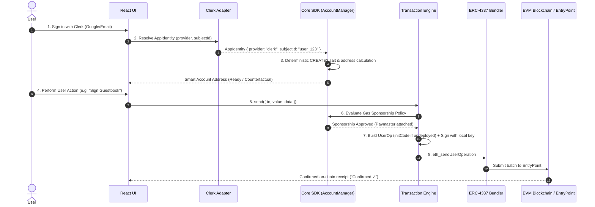

# Identity AA SDK: Architecture, Complete Workflow & Implementation Guide

An **Identity-Driven Account Abstraction SDK** built on the **ERC-4337 standard**. It enables Web2 identity authentication (such as Clerk) to seamlessly provision on-chain smart accounts, submit gas-sponsored transactions, and eliminate seed phrases and wallet popups.

---

## 1. Executive Summary & Design Philosophy

### The Problem It Solves
Traditional Web3 onboarding introduces extreme friction:
- Requiring browser wallet extensions (MetaMask, Phantom).
- Demanding users write down 12/24-word seed phrases.
- Forcing users to buy and hold native gas tokens (ETH) before doing anything.
- Showing confusing transaction approval popups with raw hex calldata and gas limits.

### The Identity AA Solution
- **Web2 Login is the Wallet**: Authenticating with Clerk (Google, Email, Passkey) immediately creates and resolves a deterministic smart contract account.
- **Immediate Address Availability**: The smart account address is available instantly before any on-chain contract is deployed (counterfactual).
- **100% Gas Sponsorship**: Transactions are sponsored via an ERC-4337 Paymaster, requiring zero native ETH from the user.
- **No Low-Level Vocabulary**: Developers and users interact with high-level actions (`send()`, `execute()`, `"Confirmed ✓"`) rather than `UserOperations`, `bundlers`, or `EntryPoint` logic.

---

## 2. System Architecture & Monorepo Structure

```text
┌────────────────────────────────────────────────────────────────────────┐
│                          APPLICATION LAYER                             │
│       React / Next.js App   •   Web3 Guestbook Demo (@identity-aa-sdk/demo)│
└──────────────────────────────────┬─────────────────────────────────────┘
                                   │
┌──────────────────────────────────▼─────────────────────────────────────┐
│                    REACT ADAPTER (@identity-aa-sdk/react)               │
│   <IdentityAAProvider />   •   useSmartAccount()   •   useTransaction()│
└──────────────────┬─────────────────────────────────┬───────────────────┘
                   │                                 │
┌──────────────────▼───────────────┐ ┌───────────────▼───────────────────┐
│   CLERK ADAPTER (@identity-aa-sdk/clerk)│ │      CORE ENGINE (@identity-aa-sdk/core)     │
│   ClerkIdentityResolver          │ │  • AccountManager (CREATE2 / Caching)│
│   (Structural Clerk Session)     │ │  • TransactionEngine (State Machine) │
└──────────────────┬───────────────┘ │  • GasPolicyManager (Sponsorship)    │
                   │                 │  • BundlerClient (RPC / Error Map)   │
                   │                 │  • KeyStore / LocalSigner (ECDSA)    │
                   └────────────────►└─────────────────┬─────────────────┘
                                                       │
┌──────────────────────────────────────────────────────▼─────────────────┐
│                        ON-CHAIN INFRASTRUCTURE                         │
│  ERC-4337 EntryPoint (0.7)  •  SmartAccount.sol  •  SmartAccountFactory.sol  •  Paymaster.sol │
└────────────────────────────────────────────────────────────────────────┘
```

### Workspace Packages

| Package | Purpose | Key Responsibilities |
|---|---|---|
| **`@identity-aa-sdk/core`** | Core engine & state machine | Account derivation, gas policy, UserOp builder, bundler client, error translator. |
| **`@identity-aa-sdk/clerk`** | Identity resolver adapter | Extracts `AppIdentity` from Clerk sessions without third-party package lock-in. |
| **`@identity-aa-sdk/react`** | React hooks & context provider | `<IdentityAAProvider>`, `useSmartAccount()`, `useTransaction()`, `useIdentityAA()`. |
| **`@identity-aa-sdk/demo`** | Production demo application | Web3 Guestbook showcasing 1-click persona logins, counterfactual address, and gas sponsorship. |
| **`contracts/` / `src/`** | Foundry Solidity contracts | `SmartAccount.sol`, `SmartAccountFactory.sol`, `Paymaster.sol`. |

---

## 3. The 8-Step End-to-End Workflow



### Step 1: Web2 Authentication
The user logs in with their standard Web2 account (Clerk). No Web3 wallet extension is requested.

### Step 2: Identity Resolution
`ClerkIdentityResolver` extracts a normalized `AppIdentity` tuple:
```json
{
  "provider": "clerk",
  "subjectId": "user_2XYZ987ABC",
  "email": "user@example.com"
}
```

### Step 3: Deterministic Signer & Counterfactual Address
1. The SDK looks up or creates a non-extractable device signing key in `KeyStore`.
2. Computes an `AccountKey`:
   $$\text{salt} = \text{keccak256}(\text{provider} \parallel \text{subjectId} \parallel \text{chainId} \parallel \text{signerKeyId})$$
3. Computes the deterministic CREATE2 address:
   $$\text{address} = \text{CREATE2}(\text{factoryAddress}, \text{salt}, \text{initCode})$$
4. The address is immediately returned to the UI (e.g. `0x7099...79C8`). No gas or on-chain transaction was needed!

### Step 4: Transaction Intent Creation
When the user clicks an action in the application, the app calls `useTransaction().send()`:
```typescript
const receipt = await send({
  to: "0x0000000000000000000000000000000000000001",
  value: 0n,
  data: "0x12345678",
});
```

### Step 5: Gas Policy & Sponsorship Decision
`GasPolicyManager` evaluates the intent:
- Checks if environment is `production` vs `development`.
- Checks rate limits (e.g., max 5 transactions per 60 seconds).
- Checks contract and method allowlists.
- When approved, instructs the engine to attach the Paymaster.

### Step 6: UserOperation Assembly
The `TransactionEngine`:
1. If the account is not yet deployed on-chain (`isDeployed === false`), sets `initCode = factoryAddress + factory.createAccount(owner, salt)`.
2. Formats `callData = account.execute(to, value, data)`.
3. Calls Bundler `eth_estimateUserOperationGas` to populate verification, call, and pre-verification gas limits.
4. Generates `paymasterAndData` from the Paymaster contract.

### Step 7: Cryptographic Signing & Bundler Submission
1. Computes `userOpHash = EntryPoint.getUserOpHash(userOp, chainId)`.
2. Signs the hash using the local ECDSA signer.
3. Submits `eth_sendUserOperation` to the Bundler JSON-RPC.

### Step 8: On-Chain Execution & Lifecycle Updates
1. The Bundler bundles the UserOp into an Ethereum transaction sent to the canonical `EntryPoint`.
2. `EntryPoint` deploys the account (if counterfactual), validates the signature, debits the paymaster, and calls `execute()`.
3. The SDK state machine transitions `Building` $\to$ `Estimating` $\to$ `Signing` $\to$ `Submitting` $\to$ `Pending` $\to$ `Confirmed`.
4. The UI displays **"Confirmed ✓"**.

---

## 4. How to Implement in a React / Next.js Application

### Installation

In your application root:
```bash
npm install @identity-aa-sdk/core @identity-aa-sdk/clerk @identity-aa-sdk/react
```
*(Optional: If using real Clerk UI widgets)*:
```bash
npm install @clerk/clerk-react
```

---

### Step 1: Configure the SDK Provider

Create a wrapper component in your React app:

```tsx
// src/SmartAccountProvider.tsx
import React, { useMemo } from "react";
import { useClerk } from "@clerk/clerk-react";
import { ClerkIdentityResolver } from "@identity-aa-sdk/clerk";
import { IdentityAAProvider } from "@identity-aa-sdk/react";
import type { SDKConfig } from "@identity-aa-sdk/core";

const sdkConfig: SDKConfig = {
  environment: "development",
  network: {
    chainId: 31337,
    rpcUrl: "http://127.0.0.1:8545",
    entryPointAddress: "0x0000000071727De22E5E9d8BAf0edAc6f37da032",
    bundlerUrl: "http://127.0.0.1:4337",
    factoryAddress: "0x5FbDB2315678afecb367f032d93F642f64180aa3",
    paymasterAddress: "0xe7f1725E7734CE288F8367e1Bb143E90bb3F0512",
  },
  sponsorship: {
    type: "full", // 100% gas sponsored for all transactions
  },
};

export function SmartAccountProvider({ children }: { children: React.ReactNode }) {
  const clerk = useClerk();

  // Pass Clerk session getter to the resolver
  const resolver = useMemo(() => {
    return new ClerkIdentityResolver(() => clerk.session);
  }, [clerk.session]);

  return (
    <IdentityAAProvider config={sdkConfig} resolver={resolver}>
      {children}
    </IdentityAAProvider>
  );
}
```

---

### Step 2: Display Smart Account Profile

```tsx
// src/components/UserProfile.tsx
import React from "react";
import { useSmartAccount } from "@identity-aa-sdk/react";

export function UserProfile() {
  const { address, isDeployed, isLoading, error } = useSmartAccount();

  if (isLoading) return <div>Resolving Smart Account...</div>;
  if (error) return <div>Error: {error.message}</div>;

  return (
    <div className="profile-card">
      <h3>Your Smart Account</h3>
      <p>Address: <code>{address}</code></p>
      <span className="badge">
        {isDeployed ? "● Deployed on-chain" : "● Ready (Counterfactual)"}
      </span>
      <span className="badge">⚡ 100% Gas Sponsored</span>
    </div>
  );
}
```

---

### Step 3: Execute Gas-Sponsored Transactions

```tsx
// src/components/ActionButton.tsx
import React from "react";
import { useTransaction } from "@identity-aa-sdk/react";

export function ActionButton() {
  const { send, isLoading, isSuccess, isError, error, transactionHash } = useTransaction();

  const handleAction = async () => {
    try {
      const receipt = await send({
        to: "0x1234567890123456789012345678901234567890",
        value: 0n, // 0 ETH
        data: "0x", // Optional smart contract calldata
      });
      console.log("Transaction confirmed in block:", receipt.blockNumber);
    } catch (err) {
      console.error("Failed to execute transaction:", err);
    }
  };

  return (
    <div>
      <button onClick={handleAction} disabled={isLoading}>
        {isLoading ? "Submitting on-chain..." : "Submit Action"}
      </button>

      {isSuccess && <p className="success">Confirmed ✓ (Tx: {transactionHash})</p>}
      {isError && <p className="error">Error: {error?.message}</p>}
    </div>
  );
}
```

---

## 5. Security & Invariant Mitigations

The SDK implements strict threat mitigations verified by automated test suites:

| Threat / Risk | Mitigation Mechanism | Verified In |
|---|---|---|
| **Re-initialization Attack** | `SmartAccount.sol` has single-init guard (`AlreadyInitialized()`). | `test/SecurityHardening.t.sol` |
| **Unauthorized Direct Calls** | `execute()` / `executeBatch()` restricted to `owner` or canonical `EntryPoint`. | `test/SmartAccount.t.sol` |
| **Signature Forgery** | `validateUserOp()` validates ECDSA signature against owner; returns `1` (`SIG_VALIDATION_FAILED`) without reverting. | `test/SecurityHardening.t.sol` |
| **Paymaster Drain / Abuse** | `GasPolicyManager` enforces strict rate limits, spend caps, and method allowlists. | `packages/core/tests/securityHardening.test.ts` |
| **Replay Attacks** | `userOpHash` cryptographically binds `chainId`, `entryPointAddress`, and sequential `nonce`. | `packages/core/tests/transactionEngine.test.ts` |
| **Key Leakage** | Signing keys are managed in isolated `KeyStore` instances without exposing raw secrets. | `packages/core/tests/securityHardening.test.ts` |

---

## 6. Monorepo Verification & Testing Commands

To run the complete verification suite across the entire project:

```bash
# 1. Compile all TypeScript workspaces and contracts
npm run build
npm run build:contracts

# 2. Run all Foundry contract tests (39 tests)
npm run test:contracts

# 3. Run all unit & integration tests (115 tests)
npm run test:unit

# 4. Run end-to-end smoke tests against local Anvil chain
npm run test:smoke

# 5. Run full test suite in sequence
npm test
```
