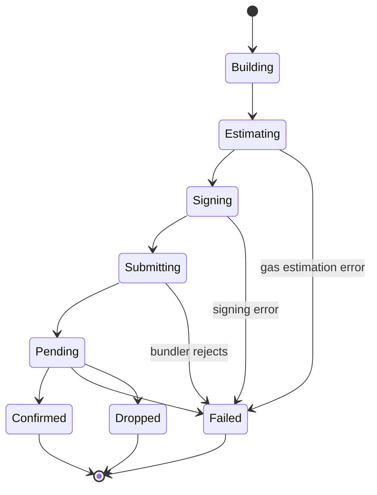

# Transaction Engine

## Purpose

Converts a developer's transaction intent (`{to, value?, data?}` or a
batch) into a signed, submitted, and confirmed ERC-4337 UserOperation,
while exposing only `sendTransaction` / `execute` / `receipt`
publicly.

## Lifecycle Model

```text
Developer Intent
      ↓
Account Resolution        (from Account Manager; may be undeployed)
      ↓
Account State              (deployed? existing nonce?)
      ↓
Nonce Resolution            (query EntryPoint.getNonce)
      ↓
Gas Estimation               (verification + call + preVerification)
      ↓
Operation Construction        (assemble UserOperation fields)
      ↓
Sponsorship Decision            (see GAS_ABSTRACTION.md)
      ↓
Signing                          (see KEY_MANAGEMENT.md)
      ↓
Bundler Submission                 (see BUNDLER.md)
      ↓
Execution (on-chain)
      ↓
Confirmation / Receipt
```

## State Machine



- **Building**: intent validated, account resolved.
- **Estimating**: gas fields computed; sponsorship decision requested.
- **Signing**: UserOperation hash signed by the account's signer.
- **Submitting**: sent to bundler via `eth_sendUserOperation`.
- **Pending**: accepted by bundler, awaiting inclusion.
- **Confirmed**: receipt retrieved and success == true.
- **Failed**: any terminal error (see `ERROR_MODEL.md` for
  categorization); the handle exposes the translated SDK error.
- **Dropped**: bundler mempool dropped the operation before inclusion
  (e.g., expired, replaced) — surfaced as a distinct terminal state so
  the developer can decide whether to retry.

## Retries

- Retries are permitted only for transient submission failures
  (network/bundler unavailability), not for validation or execution
  failures. The engine does not automatically resubmit with different
  parameters after a rejection — that is a developer decision,
  surfaced via a retryable error flag (`ERROR_MODEL.md`).

## Timeout

- A configurable submission timeout applies to the `Pending` state;
  exceeding it surfaces as a `TransactionError` with a retryable flag,
  not a silent hang.

## Cancellation / Replacement

- MVP does not support cancel/replace-by-fee-bump. This is a roadmap
  item (see `ROADMAP.md`) contingent on nonce-key design work.

## Receipt Handling

- `receipt` includes at minimum: success flag, transaction hash,
  block reference, and (on failure) the translated error category.
- Receipt retrieval is via bundler polling (`eth_getUserOperationReceipt`
  equivalent), abstracted entirely inside `BUNDLER.md`.

## Batch Transactions

- `account.execute([...])` follows the same state machine, with a
  single UserOperation whose `callData` encodes multiple calls. Per-
  call failure semantics (partial success) are determined by the
  Smart Account's `execute` batching behavior (see `SMART_ACCOUNT.md`)
  and must be documented there, not reinvented here.
